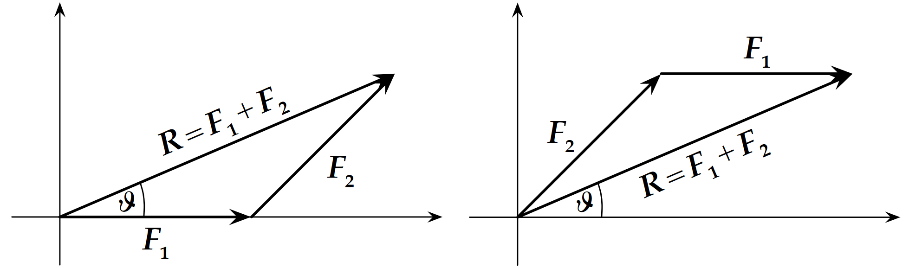

# Background

**OVERALL GOALS:** Use a “force table" to study:

1.  how vectors are added

2.  the concept of force vectors in equilibrium

There are two types of physical quantities: ***scalars*** and
***vectors***. The number of attributes required to define a scalar and
a vector distinguishes them. A ***scalar*** has just a **magnitude**
telling us how large or small something is (or positive or negative); an
example of a scalar quantity is temperature or speed
($\\meter\\per\\second$)

A ***vector***, meanwhile, is a quantity that is described by both a
**magnitude** ***and*** **direction**. Examples of vectors are velocity
(speed but with a direction; $\\meter\\per\\second$ at some angle) or
force (a push or pull on an object with a specific magnitude at some
direction).

A force example: a force may be $100\\,\\newton$ in magnitude with
direction $90\\degree$ counterclockwise from the *x*-axis. This force
vector is written as $100\\,\\newton \\ @ \\ 90\\degree$. We will use
bold face type to indicate a vector ($\\vec{F_i}$) while the regular
typeface will indicate scalar magnitudes and the components of a vector
(*F**i*).

When several vectors act on an object, it is generally desirable to
determine the sum of these vectors, called the **resultant vector**.
Suppose force vectors *F⃗*1 and *F⃗*2 act on a body.
The resultant *R⃗* is defined by the vector sum of the two forces, thus
*R⃗* = *F⃗*1 + *F⃗*2.
If many forces act on the body, then we sum all the forces together
$$\\vec{R} = \\sum\_{i=1}^N \\vec{F}\_i.$$
The resultant force is a single force which can completely represent a
number of individual forces acting. When the resultant force is zero,
the object is said to be in equilibrium.

There are two methods of vector addition to consider:

1.  The graphical method (reviewed here, but not conducted during lab
    today)

2.  The method of components (conducted during lab today)

## Graphical Method

Vectors *F⃗*1 and *F⃗*2
(Fig. <a href="#M01Fig01" data-reference-type="ref"
data-reference="M01Fig01">1</a>) are added graphically as follows:
Beginning at a convenient point on a piece of graph paper, usually at
the origin of a rectangular coordinate system draw one of the vectors as
an arrow to scale and pointing in the proper direction. Place the second
vector with its tail at the tip of the first, again drawn to scale and
pointing in the proper direction. The resultant *R⃗* is the vector drawn
from the tail of the first vector to the tip of the second. The process
is illustrated in Fig. <a href="#M01Fig02" data-reference-type="ref"
data-reference="M01Fig02">2</a> demonstrating the addition operation
does not depend on the order of addition. Thus, like scalar addition,
*F⃗*1 + *F⃗*2 = *F⃗*2 + *F⃗*1 = *R⃗*.

<figure>

<figcaption aria-hidden="true">Two force vectors <em>F⃗</em>1 and <em>F⃗</em>2</figcaption>
</figure>

<figure>

<figcaption aria-hidden="true">Adding 2 vectors <em>F⃗</em>1 and <em>F⃗</em>2, using the graphical
(“tail-to-tip”) method.</figcaption>
</figure>

It is important that an appropriate scale be selected with which the
vectors are drawn (e.g. $1\\,\\newton = 10\\,\\centi\\meter$). The
magnitude of *R⃗* is determined using a ruler, and the angle *θ* is
measured using a protractor. Since the negative of a vector is merely
the vector pointing in the opposite direction, subtraction is addition
with the negative vector pointing in the opposite direction. Errors can
be significantly reduced by using a scale that makes the drawing as
large as possible. Neatness counts!

## Method of Components

The method of components is a much more useful and quantitatively
accurate method of vector addition. Each vector is resolved into
components along the *x*− and *y*-axes. That is to say, the vector
addition of the two components of the vector is the vector itself. Thus
if two vectors are to be added, we add the components along each axis to
form the components of the resultant.

<figure>

<figcaption aria-hidden="true">Adding 2 vectors <em>F⃗</em>1 and <em>F⃗</em>2 using the method of
components. </figcaption>
</figure>

In Fig. <a href="#M01Fig03" data-reference-type="ref"
data-reference="M01Fig03">3</a>, the magnitudes and directions are shown
for the two force vectors *F⃗*1 and *F⃗*2 . The
magnitudes of the *x* and *y* components are calculated for this example
as follows:
$$\\label{Eq:M1_cosSinAngle}
  \\begin{aligned} %
    F\_{1,x} & = F_1 \\, \\cos(\\theta\_{1}) & \\qquad F\_{2,x} & = F_2 \\, \\cos(\\theta\_{2}) \\\\
            & = 1\\,\\newton\\ \\cos(0\\degree) = 1\\,\\newton & &  = 1\\,\\newton\\ \\cos(45\\degree) = 0.707\\,\\newton \\\\
    F\_{1,y} & = F_1 \\,\\sin(\\theta_1) & \\qquad F\_{2,y} & = F_2 \\,\\sin(\\theta_2) \\\\
            & = 1\\,\\newton\\ \\sin(0\\degree) = 0\\,\\newton & &  = 1\\,\\newton\\ \\sin(45\\degree) = 0.707\\,\\newton.
  \\end{aligned}$$
Next, add the *x*-components
$$\\vec{R}\_x = F\_{1,x} + F\_{2,x} = 1\\,\\newton + 0.707\\,\\newton = 1.707\\,\\newton.$$
Then, add the *y*-components
$$\\vec{R}\_y = F\_{1,y} + F\_{2,y} = 0\\,\\newton + 0.707\\,\\newton = 0.707\\,\\newton.$$
The magnitude of the resultant is found using the relation
*R⃗*2 = *R⃗**x*2 + *R⃗**y*2,
or
$$\\vec{R} = \\sqrt{\\left(1.707\\,\\newton\\right)^2 +
    \\left(0.707\\,\\newton\\right)^2} = 1.848\\,\\newton.$$
The angle *θ* specifies the direction of the resultant and it can be
calculated by noting that
tan *θ* = *R**y*/*R**x*
and
$$\\begin{aligned}
 %
\\label{Eq:M1_arctan}
  \\theta = \\arctan (R\_{y} / R\_{x}).\\end{aligned}$$

For this example illustrated in
Fig. <a href="#M01Fig04" data-reference-type="ref"
data-reference="M01Fig04">4</a>
$$\\begin{aligned}
 %
  \\tan \\theta = (0.707\\,\\newton) / (1.707\\,\\newton) = 0.414\\,\\newton,\\end{aligned}$$
$$\\begin{aligned}
 %
  \\theta = \\arctan(0.414) = 22.5\\degree.\\end{aligned}$$

<figure>
<embed src="Experiment01Figures/Figure04.pdf" id="M01Fig04"
style="width:3.5in" />
<figcaption aria-hidden="true">Example of <em>R⃗</em>, the sum of 2 vectors,
illustrating <em>x</em>- and <em>y</em>-components, a well as its
magnitude and angle with the <em>x</em>-axis.</figcaption>
</figure>

In this laboratory, an object will be presented with two known forces
acting on it. Equilibrium will be established by adding a third
**equilibrant** force *F⃗*3, such that the sum of the three
forces is zero (at equilibrium). Thus, we must find the resultant *R⃗* of
the two given forces *F⃗*1 and *F⃗*2, and find the
force *F⃗*3 =  − *R⃗* — equal in magnitude and opposite in
direction to the resultant *R⃗* of *F⃗*1 and *F⃗*2.
This is illustrated in
Fig. <a href="#M01Fig05" data-reference-type="ref"
data-reference="M01Fig05">5</a>.

<figure>
<embed src="Experiment01Figures/Figure05.pdf" id="M01Fig05"
style="width:3.6in" />
<figcaption aria-hidden="true">Illustration of the method to determine
the force <em>F⃗</em>3 needed
to balance two given forces <em>F⃗</em>1 and <em>F⃗</em>2.</figcaption>
</figure>

Here *F⃗*3 is the equilibrant force necessary to equilibrate
*F⃗*1 and *F⃗*2. Note that, the resultant of
*F⃗*1 + *F⃗*2 + *F⃗*3 is zero since the
ring is in equilibrium.

Force *F⃗*3 has the same magnitude as the resultant *R⃗*, but
acts in a direction opposite to *R⃗* (recall that
*R⃗* = *F⃗*1 + *F⃗*2). So we now have
*F⃗*3 =  − *R⃗*.
We conclude that the force necessary to equilibrate two or more forces
is equal and opposite to the resultant of the two (or more) forces. This
is additionally illustrated in an example of the force table apparatus
we will use in Fig. <a href="#M01Fig06" data-reference-type="ref"
data-reference="M01Fig06">6</a> right.

<u>**Apparatus**</u>

<figure>

<figcaption aria-hidden="true">Illustration of the force table, and an
example of to determine the force <em>F⃗</em>3 needed to balance two
given forces <em>F⃗</em>1 and
<em>F⃗</em>2.</figcaption>
</figure>

The apparatus for this experiment consist of a force table, weight
holders, and weights (see
Fig. <a href="#M01Fig06" data-reference-type="ref"
data-reference="M01Fig06">6</a>). The force table consists of a circular
tabletop mounted on a vertical rod held in a tripod support with
leveling screws. The rim of the circular top has a $360\\degree$ scale
engraved on it along which it is possible to clamp a number of pulleys.
At the center of the table is a small ring held in place by means of a
removable pin. The ends of three cords are tied to the ring with each
cord leading over a pulley and ending with a weight holder tied to its
other end. When the forces along the cords acting upon the small ring
are balanced, or in static equilibrium, the ring remains stationary. For
this lab, the force pulling on the ring is the tension of the string,
which is merely translated from horizontal on the table to vertical

Each hanging mass has an associated weight (force) due to being pulled
*down* by gravity. This weight is balanced by the *upward* tension force
of the vertical part of the cord which is merely translated from
vertical to horizontal tension by the pulley. Thus, the force pulling
the ring in the direction of the cord is

$$\\label{eq:M01_ForceG}
  \\vec{F\_\\text{weight}} = m \\times \\vec{g} = \\vec{F\_\\text{tension}}$$

For accurate measurements of the angles involved, each cord must be
aimed directly at the center of the ring requiring that the equilibrium
condition must be established when the ring is exactly centered around
the pin on the table.

# Experimental Procedure

## Preview

For today’s lab, two different cases will be assigned involving two
given vectors and the **determination of the equilibrant vector**. A
third case involves the **determination of the mass of two unlabeled
masses** by balancing the system from a single known mass.

<u>**Finding the Equilibrant (First two cases)**</u>

For each of the first two cases, you will have two given masses at given
angles (direction). Each mass, consisting of a $50\\,\\gram$ hanger plus
the necessary additional mass, will be hung from a cord routed over a
pulley at the assigned angular positions and finally tied to the ring. A
third cord, hanger, and pulley assembly is put in place for the third,
unknown force vector. Each force is the weight of the hanging mass at
the pulley angle. Determine the unknown forces for each of the two
cases.

If, for example, you are given the following case to work with
$$\\begin{array}{rll}
  \\mbox{Mass \\#1:} & 200\\,\\gram & \\mbox{@}\\,0\\degree \\\\
  \\mbox{Mass \\#2:} & 250\\,\\gram & \\mbox{@}\\,135\\degree.
\\end{array}$$
Place a pulley at $0\\degree$ and add $150\\,\\gram$ to the
$50\\,\\gram$ weight hanger for a total $200\\,\\gram$. As mentioned in
Eqn. <a href="#eq:M01_ForceG" data-reference-type="ref"
data-reference="eq:M01_ForceG">[eq:M01_ForceG]</a>, the tension on the
cord is the same on both sides of the pulley so that the downward pull
of gravity on the hanger and masses is equal to the tension in the cord
leading to the ring. Thus,
$$\\vec{F}\_1 = m g = 0.20\\,\\kilo\\gram\\times 9.8\\,\\meter\\per\\second\\squared
         = 1.96\\,\\newton\\ @\\ 0\\degree.$$
Similarly, add $200\\,\\gram$ to a $50\\,\\gram$ weight hanger and run
its cord over a pulley mounted at $135\\degree$.
$$\\vec{F}\_2 = m g = 0.25\\,\\kilo\\gram\\times 9.8\\,\\metre\\per\\second\\squared
         = 2.45\\,\\newton\\ @ \\ 135\\degree.$$

Having established the given magnitudes and directions for each of the
given forces, *F⃗*1 and *F⃗*2, adjust both the
amount of mass hanging on cord 3 and its angular position so that the
ring is stationary at the center of the table. In order for angular
measurements to be accurate, **each cord must be on a line that crosses
through the center of the table**. Sighting *along* each cord towards
the center pin can help you to easily and accurately check this.

To determine the equilibrant vector *F⃗*3, you will record
both the angular position (**direction**) and total mass (to determine
**magnitude** of the balancing force from the total hanging weight)
required to balance *F⃗*1 and *F⃗*2.

<u>**Determining 2 Unlabeled Masses (Third case)**</u>

In this case, you will experimentally **determine two unlabeled masses**
by balancing the *x* and *y* components of the force of a known mass.
Place the pulley with the known mass $M_1 = 50\\,\\gram$ at
$\\theta_1 = 0\\degree$. Experimentally determine the angles
*θ*2 and *θ*3 for the unlabeled masses
*M*2 and *M*3 that result in the ring being in
equilibrium. For this case, **assume angles *θ*2 and
*θ*3 are actual values**.

We can calculate the theoretical unlabeled masses using the method of
components. You have to solve a pair of equations for the *x* and *y*
components of force. The equation for equilibrium in the *x* direction
is
(*M*1+*M*2cos*θ*2+*M*3cos*θ*3)*g* = 0.
The equation for equilibrium in the *y* direction is
(*M*2sin*θ*2+*M*3sin*θ*3)*g* = 0.
*M*2 is eliminated by multiplying the *x* component by
sin *θ*2 and subtracting the *y* component multiplied by
cos *θ*2
*M*1sin *θ*2 + *M*3cos *θ*3sin *θ*2 − *M*3sin *θ*3cos *θ*2 = 0.
Using the known values, solve for *M*3 and enter the value in
the table.

Similarly, eliminating *M*3 gives
*M*1sin *θ*3 + *M*2cos *θ*2sin *θ*3 − *M*2sin *θ*2cos *θ*3 = 0.
Using the known values, solve for *M*2 and enter the value in
the table.

Measure *M*2 and *M*3 on the scale and enter the
values in the table.

It is good practice to **COMPLETE THE ANALYSIS OF THE FIRST CASE BEFORE
CONTINUING TO THE NEXT CASE**. If you have some error in your
experimental method or in your calculation, you can correct it before
completing all the other cases. The layout of the data table for
additional cases can then be created by copying the first case after you
are confident in your results from the first case.

## CASE 1 & 2 – Finding the Equilibrant Vector (Balancing Force)

1.  **OVERALL GOALS:**

    -   Understand how to add and balance vectors using the **method of
        components**.

    -   Conduct 3 cases of two additive, known vectors (weights at given
        angles) to experimentally determine the third balancing or
        equilibrant vector.

    -   Compare the experimental results to theoretically expected
        vectors.

    -   **Assume** $0\\degree$ is the  + *x* direction, $90 \\degree$ is
        the  + *y* direction

2.  The first two cases are:

    |                                  |                                   |
    |:---------------------------------|:----------------------------------|
    | **Case 1:**                      | **Case 2:**                       |
    | — hanger 1: 150 g @ 0$\\degree$  | — hanger 1: 100 g @ 75$\\degree$  |
    | — hanger 2: 150 g @ 70$\\degree$ | — hanger 2: 200 g @ 115$\\degree$ |
    | — hanger 3: ? kg @ ?$\\degree$   | — hanger 3: ? kg @ ?$\\degree$    |

3.  Create a data table for the first case. NOTE: The data layout for
    each of the first two cases is the same. Create for the first case
    and run the whole experiment, then you can copy/paste the same data
    table for the additional case(s).

    -   Common data section with accepted value of *g*
        ($9.803\\,\\meter\\per\\second\\squared$), mass of the hanger,
        and any other common values. You will reference these values in
        the calculations.

    -   With **three rows** (1 for each of the 3 vectors).

    -   Include **columns** for:

        -   *m**i*: hanging mass in kilograms ()

        -   *δ**m**i*: your estimate of the experimental
            uncertainty \[± value\] of the mass

        -   *F**i*: calculated magnitude of the force in
            Newtons (N) (see
            Eqn. <a href="#eq:M01_ForceG" data-reference-type="ref"
            data-reference="eq:M01_ForceG">[eq:M01_ForceG]</a>)

        -   *θ**i*: direction of the force vector in degrees

        -   *δ**θ**i*: your estimate of the experimental
            uncertainty of the angle

        -   *F**i*, *x*: calculated *x*-component of the
            force vectors (see
            Eqn. <a href="#Eq:M1_cosSinAngle" data-reference-type="ref"
            data-reference="Eq:M1_cosSinAngle">[Eq:M1_cosSinAngle]</a>).
            Reminder, Excel needs angles in radians (use RADIANS()
            function to convert)

        -   *F**i*, *y*: calculated *y*-component of the
            force vectors

    -   Create a secondary table to analyze the results of your
        measurements. This is effectively one row as there would be just
        a single value for each of the variables. The columns should
        include variables:

        -   *R⃗**x* & *R⃗**y*: the *x* and *y*
            components of the resultant vector *R⃗* of the two given
            force vectors *F⃗*1 and *F⃗*2

        -   *R⃗*mag: magnitude of the resultant force vector
            in Newtons (see Pythagorean Theorem in
            Eqn. <a href="#Eq:M1_resultantMag" data-reference-type="ref"
            data-reference="Eq:M1_resultantMag">[Eq:M1_resultantMag]</a>)

        -   *θ**R*: direction of the resultant in degrees
            (see Eqn. <a href="#Eq:M1_arctan" data-reference-type="ref"
            data-reference="Eq:M1_arctan">[Eq:M1_arctan]</a> which stems
            from trigonometry). Use ATAN2() Excel function to get angle
            as measured counterclockwise from $0\\degree$. Reminder,
            Excel returns angles in radians (use DEGREES() function to
            convert)

        -   *F⃗**x*, total experimental &
            *F⃗**y*, total experimental: the vector components
            of the measured total force, which is the vector sum of *R⃗*
            and *F⃗*3

        -   *F⃗**m**a**g*, total experimental (a.k.a.
            *δ**F⃗*3): the magnitude of the total force,
            determined in similar fashion to
            Eqn. <a href="#Eq:M1_resultantMag" data-reference-type="ref"
            data-reference="Eq:M1_resultantMag">[Eq:M1_resultantMag]</a>,
            but with *F⃗**x*, total experimental &
            *F⃗**y*, total experimental. ***Consider***: The
            **total force should be zero** because the ring is in
            equilibrium. The magnitude of the total force is therefore a
            measure of the *experimental uncertainty*. This effectively
            represents *δ**F⃗*3 where your experimental result
            would be *F⃗*3 ± *δ**F⃗*3.

        -   Based on your determined resultant *R⃗*

            -   *F⃗*3, theoretical: your expected or
                theoretical magnitude of the equilibrant force in N

            -   *m*3, theoretical: theoretical equilibrant
                mass in kg

            -   *θ*3, theoretical: theoretical equilibrant
                direction in deg. (e.g. $\\theta\_{R} + 180 \\degree$)

4.  Starting with the first case, place the respective masses on hangers
    1 & 2

5.  Unscrew the black pulleys to rotate them around the tabletop to
    their given angles

6.  With hanger 3, add or subtract masses and scoot the pulley around
    the table until the ring is as perfectly centered around the center
    pin as possible to argue equilibrium

7.  Note your *m*3 & *θ*3 values. Also note your
    estimated uncertainties *δ**m**i* & *δ**θ**i*

8.  Derive the hangers’ respective forces (e.g.
    Eqn <a href="#eq:M01_ForceG" data-reference-type="ref"
    data-reference="eq:M01_ForceG">[eq:M01_ForceG]</a>)

9.  Determine the hangers’ respective *x* and *y* components

10. Determine the resultant *R⃗* from your derived values for
    *R⃗**x*, *R⃗**y*

11. Determine the resultant’s angle *θ**R*

12. COMPARE your experimental results of hanger 3 to the theoretical
    values. Does *F⃗*3 ± *δ**F⃗*3 overlap (and
    therefore agree) with your theoretical value
    *F⃗*3, theoretical? If not, are there significant issues
    that may be contributing to the discrepancy? Discuss with instructor
    if so. To be further discussed in
    Sec. <a href="#M1:Interpretation" data-reference-type="ref"
    data-reference="M1:Interpretation">3</a>

13. Repeat for the second case

## CASE 3 – Determining 2 Unlabeled Masses

1.  **OVERALL GOALS:**

    -   Understand how to determine two unknown values of a 3 vector
        system using the **method of components**.

    -   *CONSIDER*: Each vector has two pieces of information,
        **magnitude** and **direction** — how many pieces of information
        total do we have to work from?

    -   Determine the masses of two figurines (one is a black Pikachu,
        the other is a white corgi that can each sit on their respective
        hangers) by balancing the force vectors. Treat Pikachu-black as
        *m*2 and the corgi-white as *m*3.

    -   Compare the experimental results to actual masses as measured
        with a triple-beam balance.

    -   **Assume** the angles for both Pikachu and the corgi, once
        found, are treated as given values (so you only have two
        unknowns with two equations).

2.  The third case is:

    -   hanger 1: g @ 0$\\degree$

    -   hanger 2 (Pikachu-black): ? kg @ ?$\\degree$ (angle treated as
        given once determined)

    -   hanger 3 (corgi-white): ? kg @ ?$\\degree$ (angle treated as
        given once determined)

3.  Create a data table for this case:

    -   Common data section with the accepted value of *g*
        ($9.803\\,\\meter\\per\\second\\squared$), the mass of the
        hanger, actual values of the figurines to be determined later,
        and any other common values.

    -   *m*1: Given mass will be just the hanger, so 50
        $\\gram$ (but record in )

    -   *θ*1: Angle of 0for the empty hanger

    -   *F⃗**x*, 1 & *F⃗**y*, 1: *x* and *y*
        components of the known mass’s force vector

    -   *θ*2, Pikachu-black & *θ*3, corgi-white:
        Experimentally determined direction of the force vector in
        degrees — **treat as actual given values once you find
        equilibrium. You will use these to solve for the masses later.**

    -   *m*2, Pikachu-black & *m*3, corgi-white:
        the experimental values of *m*2 and *m*3
        from Eqn. <a href="#eq:M01solveM3" data-reference-type="ref"
        data-reference="eq:M01solveM3">[eq:M01solveM3]</a> and
        Eqn. <a href="#eq:M01solveM2" data-reference-type="ref"
        data-reference="eq:M01solveM2">[eq:M01solveM2]</a>

    -   *m*2, Pikachu-black, actual &
        *m*3, corgi-white, actual: the values of
        *m*2 and *m*3 as measured on a triple-beam
        balance.

    -   % Difference of *m*2 and *m*3
        experimentally found values to the actual measured values (see
        Eqn. <a href="#M1:PercentDiff" data-reference-type="ref"
        data-reference="M1:PercentDiff">[M1:PercentDiff]</a> in
        Sec. <a href="#M1:Interpretation" data-reference-type="ref"
        data-reference="M1:Interpretation">3</a>).

4.  Place the respective masses on there hangers, with *m*1
    set to 0

5.  Unscrew the black pulleys to rotate them around the tabletop until
    you find equilibrium. You are only changing the angles of
    *θ*2, Pikachu-black & *θ*3, corgi-white. NO
    ADDITIONAL MASS IS REQUIRED.

6.  Once you’ve found equilibrium, note the
    *θ*2, Pikachu-black & *θ*3, corgi-white values
    as actual values to use in later equations (i.e. as if they’re given
    angles)

7.  Determine *m*2, Pikachu-black &
    *m*3, corgi-white using
    Eqn. <a href="#eq:M01solveM3" data-reference-type="ref"
    data-reference="eq:M01solveM3">[eq:M01solveM3]</a> and
    Eqn. <a href="#eq:M01solveM2" data-reference-type="ref"
    data-reference="eq:M01solveM2">[eq:M01solveM2]</a>

8.  Using a triple-beam balance, measure directly the actual mass of
    *m*2, Pikachu-black, actual &
    *m*3, corgi-white, actual

9.  COMPARE your experimental results of each of the unlabeled masses to
    their actual values. Calculate the % difference of *m*2
    and *m*3 experimentally found values to the actual
    measured values. What may be contributing to a larger or smaller
    difference? To be further discussed in
    Sec. <a href="#M1:Interpretation" data-reference-type="ref"
    data-reference="M1:Interpretation">3</a>.

Post-Lab Submission — Interpretation of Results on next page
$\\xrightarrow{}$

# Post-Lab Submission — Interpretation of Results

-   Make sure to submit your finalized data table (Excel sheet)

-   What is a vector?

-   Case 1 & 2 (Finding Equilibrant):

    -   Looking at your experiment, why do the two given masses not add
        up to the third mass?

    -   What are the uncertainties of Experiment 1?

    -   What are your results, and how do they compare to the
        theoretical predictions?

        -   In other words, for each of the first two cases, COMPARE
            your experimental results of hanger 3 to the theoretical
            values for hanger 3.

            -   Does *F⃗*3 ± *δ**F⃗*3 overlap (and
                therefore agree) with your theoretical value
                *F⃗*3, theoretical?

            -   Does *m*3 ± *δ**m*3 overlap with
                your theoretical value *m*3, theoretical?

            -   Does *θ*3 ± *δ**θ*3 overlap with
                your theoretical value *θ*3, theoretical?

    -   How does adding a few grams (i.e.
        *m*3 + *δ**m*3) change your results for
        *F⃗*3?

    -   How does changing the angle (i.e.
        *θ*3 ± *δ**θ*3) change your results
        *F⃗*3?

-   Case 3 (Unlabeled Masses):

    -   How do your values for *m*Pikachu-black and
        *m*corgi-white compare to your actual values from the
        triple-beam-balance?

    -   What is the percent difference between your experimentally
        determine masses and their actual measured values? Calculate the
        % difference in each of the masses using the following relation:
        $$\\begin{aligned}
         %
                \\label{M1:PercentDiff}
            \\mbox{\\% Difference} = \\frac{\\mbox{Experimental} \\ \\mbox{Value} - \\mbox{Actual} \\ \\mbox{Value}}{\\mbox{Actual} \\ \\mbox{Value}} \\times 100\\%.
            \\end{aligned}$$

    -   What uncertainties might make this difference larger or smaller?

-   What is the precision of your equipment (force table, masses, etc.)?

-   What are possible systematic errors of the experiment?
